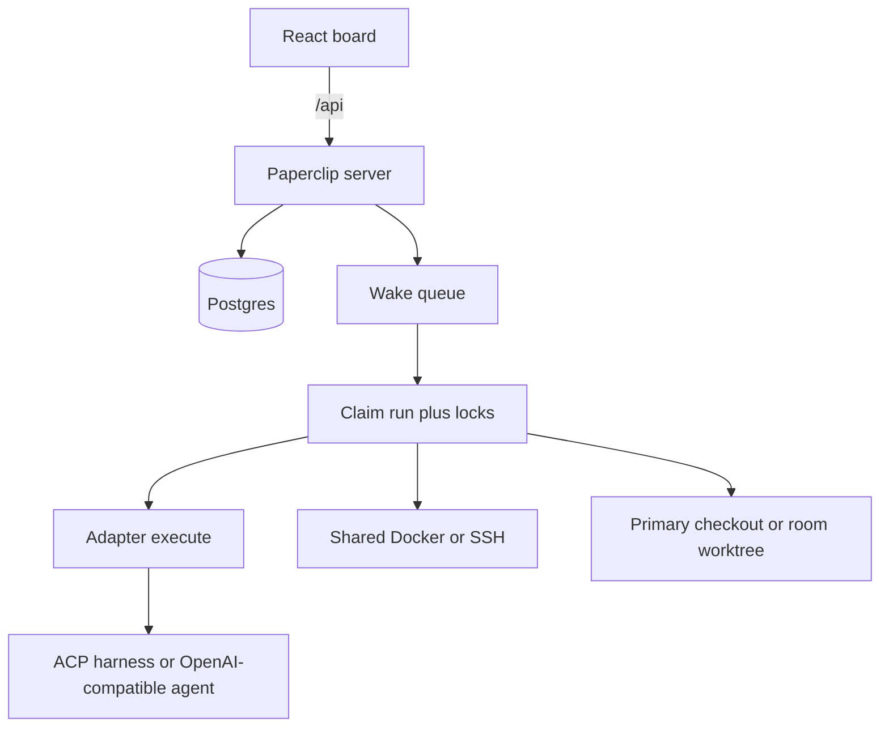

# Design build

This fork of [paperclipai/paperclip](https://github.com/paperclipai/paperclip) stays the company control plane. New work adds three product seams on top of the existing heartbeat, locks, and adapter boundary. It does not replace the control plane and it does not add a second dashboard.

Origin remote: `david-hummingbot/paperclip`. The tree matches upstream Paperclip except for the telemetry removal recorded under [Base changes already made](#base-changes-already-made).

> **Add the upstream remote before trusting that claim.** Today only `origin` is
> configured, so nothing can diff this tree against upstream:
> ```sh
> git remote add upstream https://github.com/paperclipai/paperclip
> git fetch upstream
> ```

## What this system is

Paperclip is the company that agents work in: goals, org chart, tickets, budgets, and governance. Agents wake, do one run, and sleep. Claude Code, Codex, Cursor, OpenClaw, and HTTP bots are employees, not the product.

One Node process serves the API and the React board. Embedded PGlite (Postgres-compatible, in-process) is the default database; set `DATABASE_URL` to use a real Postgres.

| Piece | Where |
| --- | --- |
| Server boot and scheduler | `server/src/index.ts` |
| HTTP app and `/api` routes | `server/src/app.ts` |
| Heartbeat loop | `server/src/services/heartbeat.ts` |
| Wake admission | `server/src/modules/wake-queue/` |
| Schema | `packages/db/src/schema/` |
| Shared enums | `packages/shared/src/constants.ts` |
| Adapter contract | `packages/adapter-utils/src/types.ts` |
| Execution target (where a process runs) | `packages/adapter-utils/src/execution-target.ts` |
| Board UI | `ui/` |

Newer modules use `domain → application → adapters` under `server/src/modules/`. The heartbeat path is still the large service above. Graft features at the seams below. Do not rewrite `heartbeat.ts` to add a provider, a computer, or a room.

## Base to keep

These behaviors stay as they are:

- Durable wake outbox (`agent_wakeup_requests`) plus run records (`heartbeat_runs`), with coalesce and defer when the same issue and agent are already executing.
- Two locks on an issue. `checkoutRunId` is the workflow claim. `executionRunId` is stamped only when a run is claimed, under `SELECT … FOR UPDATE`.
- Adapter contract: the host builds cwd, secrets, skills, tools, session, and task context. The adapter executes and returns usage, cost, a session blob, and an error class.
- Company-scoped rows. Cross-tenant lookups return 404 (`server/src/routes/authz.ts`).
- Budget gate at claim time, then pause and cancel when observed spend crosses the policy (`server/src/services/budgets.ts`).
- Task-keyed session resume on `agent_task_sessions`, with a config fingerprint so model, secret, or workspace changes force a fresh session.
- Orphan recovery that checks the process is gone before failing a run (`server/src/services/recovery/service.ts`).

A run still resolves connection, computer, cwd, secrets, and skills, then calls `adapter.execute`.



## Base changes already made

The fork starts from a base with no unprompted outbound network calls. This is a
prerequisite for the features below, not one of them.

- **First-party telemetry removed.** `packages/shared/src/telemetry/`, `server/src/telemetry.ts`, `cli/src/telemetry.ts`, the `agent-task-run-telemetry` and `connector-telemetry` emitters, the generated event contract, and every call site are gone. Upstream shipped this enabled by default, posting an install UUID plus raw `agent_id`/`model`/`error_code` dimensions to `telemetry.paperclip.ing`. `AGENTS.md` rule 7 now documents two data paths (Observability, run log) instead of three and records the removal so an upstream merge resolves the right way.
- **Announcements are opt-in.** `PAPERCLIP_ANNOUNCEMENTS_ENABLED=true` turns the feed poll on; unset means no request.
- **Feedback trace sharing has no default destination.** It uploads only when an operator sets `PAPERCLIP_FEEDBACK_EXPORT_BACKEND_URL` to a host they run.
- **Plugin `telemetry.track` is a validated no-op.** The SDK capability stays so third-party plugins install and run unchanged; the host drops the event instead of forwarding it. `ctx.logger` and `ctx.metrics` still write to the instance database.

Unchanged and already clean: Sentry has no hardcoded DSN and stays off until `SENTRY_DSN*` is set; OpenTelemetry is a no-op until an OTLP endpoint is set; `ui/index.html` loads no CDN, font, or analytics script.

Two outbound calls remain and are not phone-home to Paperclip: `cli/src/update-notice.ts` checks npm for a newer `paperclipai` (`PAPERCLIP_UPDATE_CHECK=0` disables it), and `ui/src/pages/AdapterManager.tsx` fetches `registry.npmjs.org` **from the browser** for adapter package versions, which exposes the operator's own IP rather than the server's.

## Management UI

The React board is the only management app. `ui/src/pages/Dashboard.tsx` is the overview: counts, spend, run activity, paused agents, and the activity feed. `/dashboard/live` is the live view.

Day-to-day control is `ui/src/components/Sidebar.tsx`. Its actual structure is an ungrouped top block plus two collapsible sections — there is no "Operations" section and no Approvals item:

| Block | Items |
| --- | --- |
| Top (ungrouped) | Search, Dashboard, Inbox, Decisions\*, Status\*, Conference Room\* |
| Work | Tasks, Projects\*, Routines, Artifacts, Cases\*, Pipelines\*, Goals\*, Workspaces\* |
| Org | Agents, Skills, Connectors, Audit (or Org / Connectors / Timeline / Costs / Activity / Settings in the non-streamlined variant) |

\* Feature-flagged. This matters for the work below: **Projects** needs `streamlinedUiEnabled`, **Workspaces** needs `enableIsolatedWorkspaces` and is hidden by default, and **Conference Room** needs `conferenceRoomChatEnabled`. Environments already live at `company/settings/instance/environments`.

Place new controls on those screens:

| New thing | Screen |
| --- | --- |
| Provider connections | Existing AI connection / connector flow |
| Compute placement | Agent settings, plus the environments screen for hosts, keys, and images |
| Coordination rooms | Board: open a room, pick agents, create the workspace, read the thread |

If room worktrees are meant to be inspectable, the Workspaces page has to come out from behind its flag, or the room screen has to show them itself.

## Feature 1 — provider catalog

### Current limit

`packages/shared/src/ai-connections.ts` allows only `anthropic`, `openai`, `openrouter`, and `xai`. Each is hard-wired to one harness and one env var. OpenRouter is compatible only with OpenCode and model ids that start with `openrouter/`. ACP is `engine: "acp"` inside the Claude, Codex, Gemini, Kimi, and Grok adapters. The retired `acpx_local` adapter stays a tombstone (`server/src/adapters/registry.ts`). OpenCode can merge a custom OpenAI-compatible provider only through the `PAPERCLIP_OPENCODE_PROVIDERS` env JSON. Venice is not a provider.

Two facts make this more than an enum change:

1. **There is no `ai_connections` table.** An AI connection is a `connection_grants` row (`packages/db/src/schema/tool_access.ts`) carrying `credentialSecretRefs`, with a per-user default in `ai_connection_defaults`. Company scoping and secret storage already exist; the provider identity is what is hard-coded.
2. **The provider list is also a database CHECK constraint.** `ai_connection_defaults_provider_check` pins `('anthropic','openai','openrouter','xai')` in SQL. A new provider needs a migration, not only a TypeScript edit.

There is also an existing escape hatch that overlaps this feature. `stripAiAuthBindings` in `server/src/services/ai-connection-runtime.ts` deliberately **preserves** `ANTHROPIC_BASE_URL`, `OPENAI_BASE_URL`, and `XAI_BASE_URL` in the agent environment, so an operator can already point a harness at a different endpoint by hand. Meanwhile `assertManagedAiProjectAuth` **rejects** `--api-key`, `--auth-token`, `--config`, and `--settings` overrides whenever a managed AI connection is selected.

Two undocumented per-harness env hatches already do most of what this feature promises, and the feature must subsume them rather than become a third way:

| Hatch | Harness | Shape |
| --- | --- | --- |
| `PAPERCLIP_OPENCODE_PROVIDERS` | `opencode_local` | JSON map of provider id to OpenCode provider config (`options.baseURL`, `models`) |
| `PAPERCLIP_CODEX_PROVIDERS` | `codex_local` | JSON mapping 1:1 onto Codex `[model_providers.<id>]` plus a top-level `model_provider` |

Both accept plain `http://`, expand `{env:VAR}` placeholders server-side, and take a **map**, so several endpoints can be defined at once. Neither is documented anywhere in `doc/` or `README.md`. Their limits are the shape of the problem:

- **One active provider per agent.** An agent has a single `adapterConfig.model`, and there is no per-run or per-task model override anywhere in the codebase. OpenCode selects the provider through the `provider/model` ref; Codex pins one `model_provider`. Several providers can be *defined*, but switching means editing the agent.
- **Env resolves in two layers** — an environment's `envVars` are the base and the agent's `config.env` overrides (`server/src/routes/agents.ts`). So per-agent endpoints work today; a shared catalog belongs on the environment.
- **Local models work but are second-class.** LM Studio, Ollama and vLLM all expose an OpenAI-compatible `/v1`, so they run through these hatches, but they get no managed connection: no credential UI, no attribution, no budget binding. OpenRouter, being in the enum, gets all three. Running both systems side by side is the actual mess this feature removes.

### Decision

Split the credential from the harness. A provider connection is a company-scoped record, not a TypeScript enum.

| Field | Meaning |
| --- | --- |
| `name` | Display name |
| `wire` | `openai_chat`, `openai_responses`, `anthropic`, or `acp` |
| `baseUrl` | API root, for example `https://api.openai.com/v1`, `https://openrouter.ai/api/v1`, `https://api.venice.ai/api/v1`, or any other `/v1` |
| `apiKeySecretRef` | Key in the existing company secret store |
| Model discovery | `GET {baseUrl}/models` when the host supports it, otherwise a static list |
| Extra headers | Optional. OpenRouter referer headers and private gateways use this |

OpenAI, OpenRouter, Venice, Anthropic, xAI, and `local_openai` ship as presets: known base URL and wire format. `local_openai` defaults to `http://localhost:1234/v1` with no key and covers LM Studio, Ollama and vLLM, which are the same shape. A custom endpoint is the same record with a user-supplied base URL. Adding a vendor does not add a branch in compatibility code.

**`baseUrl` validation must permit loopback and private addresses.** The announcements feed rejects private destinations through `guardedRemoteHttpFetch`; applying that guard to provider base URLs by reflex would block every local model. A provider endpoint is operator-supplied configuration, not an attacker-supplied URL, so it is validated for scheme and shape only. Note that `localhost` resolves on the agent's computer, not the Paperclip host: a Docker agent needs `host.docker.internal`, an SSH agent needs a reachable address on that host. Surface that in the connection form rather than letting it fail at run time.

**One connection per agent, not a routing table.** A connection record is *the* provider an agent uses, selected on the agent alongside its harness — not a pool the agent picks from per task. Fallback chains, cost-based routing, and cheap-local/hard-remote splits are a separate feature with their own failure semantics; they are explicitly out of scope here. This keeps the record a straight replacement for today's one-model-per-agent reality instead of quietly inventing a router.

The connection's `baseUrl` becomes the **single** source of a custom endpoint. The `*_BASE_URL` env passthrough is the legacy path: keep it working for an agent with no managed connection, and have the connection win when one is selected, so there is one precedence order rather than two. The new generic harness has to be reachable through `assertManagedAiProjectAuth` — that guard treats a caller-supplied endpoint as a conflict today and will block the harness until it learns the difference between an operator override and a connection-supplied base URL.

The agent picks a harness separately:

- **ACP harness.** Keep the current Claude, Codex, Gemini, Kimi, and Grok adapters. When the harness can speak OpenAI-compatible HTTP, inject the connection base URL and key. A later step may register an arbitrary ACP command (`command` plus `args`) without a new adapter package per vendor.
- **Generic OpenAI-compatible harness.** One new adapter. It calls `{baseUrl}/chat/completions` or the Responses API with the Paperclip wake payload and the tool gateway. Venice and OpenRouter are two connections, not two adapters. This harness has no file or shell access, so it is the right fit for an endpoint that serves nothing but completions — not the route to running a local model as an ordinary agent.

### A local model is an ordinary agent

The point of a local model is cost, not a reduced role: a smaller model running
on the box handles the simpler tasks more cheaply than a cloud model, and it is
expected to do **the same kind of work as every other agent** — edit files, run
commands, open pull requests.

That rules out the generic harness as the answer. A raw completions call has no
file or shell tools, so an agent on it could only talk. Parity comes from
pointing an existing CLI harness at the connection instead:

- `opencode_local` and `codex_local` already accept an arbitrary
  OpenAI-compatible endpoint, today through the undocumented
  `PAPERCLIP_OPENCODE_PROVIDERS` and `PAPERCLIP_CODEX_PROVIDERS` env JSON.
- Injecting the selected connection's `baseUrl`, key and model into that env
  turns "which model does this agent use" into a connection choice, with the
  agent's tools, skills, workspace and permissions unchanged.

So the local-model story is **connection injection into the CLI adapters**,
which is the unfinished half of build-list item 3. The `openai_compatible`
adapter stays for endpoints that genuinely serve only completions; it is not
how a local model becomes a working agent.

Do not route this through `paperclip_runner`. The host still builds secrets, cwd, and session.

**Session side effect.** `adapterType` is part of the session key (see Feature 3). Moving an existing agent onto the generic harness changes its `adapterType` and therefore resets every one of its sessions. Say so in the migration UI; do not let it look like data loss.

## Feature 2 — agent computer

### Current limit

Checkout strategy and machine are different things, and neither is "this agent owns a computer."

- Projects choose `project_primary`, `git_worktree`, `adapter_managed`, or `cloud_sandbox` (`packages/shared/src/validators/project.ts`). That is a directory for a task.
- `agents.defaultEnvironmentId` points at an environment. Drivers today are `local`, `ssh`, `sandbox`, and `plugin` (`packages/shared/src/constants.ts`, `server/src/services/environment-config.ts`).
- SSH already stores host, port, username, absolute remote path, `privateKeySecretRef`, known hosts, and strict host key checking. The private key is a secret ref. Probe exists before save.
- Cloud sandboxes (e2b, Daytona, Modal, Cloudflare, Kubernetes, and others) are short-lease plugins. There is no Docker driver on the Paperclip host.

The blocking problem is narrower and more concrete than "environments are instance-level." `packages/db/src/schema/environments.ts` has **no `companyId`** and two unique indexes that forbid per-agent rows:

| Index | Effect |
| --- | --- |
| `environments_name_idx` | `name` is unique **across the whole instance**. Two companies cannot both have an environment called `condor-agent`. |
| `environments_local_driver_idx` | Exactly **one** `local` environment may exist instance-wide. This one is **correct and must stay**: see below. |

### Decision

Compute placement is per agent and independent of the model connection.

| Placement | Meaning | Mechanism |
| --- | --- | --- |
| `shared` | No dedicated machine. Runs use the project cwd on the Paperclip host. | Today's `local` environment plus the project workspace strategy. |
| `docker` | One long-lived container for this agent. | New first-class driver, not a cloud sandbox plugin. |
| `ssh` | One existing host. VPS or full VM. | Existing SSH environment config, shown as this agent's computer. |

**Local isolation is Docker. A full VM is an SSH target.** The app does not boot a hypervisor.

**Step 0 is the migration, and nothing else can land before it:** add `companyId` and `agentId` to `environments` and re-scope `environments_name_idx` so names are unique per owner. Until then a second company with a same-named agent fails on a unique violation.

**Do not touch `environments_local_driver_idx`.** An earlier draft of this document called for re-scoping it per company. That is wrong. `ensureLocalEnvironment` ignores the `companyId` argument it accepts: the `local` environment is deliberately one instance-level row shared by every company, and the heartbeat inserts it with `ON CONFLICT ("driver") WHERE driver = 'local'`, which only matches an index whose predicate is exactly that. Narrowing the predicate makes the upsert fail with *no unique or exclusion constraint matching the ON CONFLICT specification*, and because `ensureLocalEnvironment` sits on nearly every run path, one broken index takes out most of the heartbeat suite. A per-agent computer is a `docker` or `ssh` row, never `local`, so this index was never in the way.

Docker:

- One container per agent, with its own filesystem, user, and network namespace.
- Created on first use and reused across heartbeats. A volume holds the home directory and workspaces.
- Pause stops the container. Terminate removes it.
- The heartbeat `docker exec`s into the container and runs the adapter there.
- Image, memory, and CPU limits live on the environment config.
- No SSH key for the local Docker path.

**Where it plugs in:** `AdapterExecutionTarget` in `packages/adapter-utils/src/execution-target.ts`, today a union of `local | ssh | sandbox` that `runAdapterExecutionTargetProcess` dispatches on. A `docker` target is a fourth member of that union plus a config schema and probe in `server/src/services/environment-config.ts`. It is not a change to `heartbeat.ts`. The reason not to reuse the sandbox-provider plugin path — which already has lease, lifecycle, and duplex-transport machinery — is that those leases are short and the container here is long-lived; state the trade-off in the implementation PR rather than leaving it implicit.

SSH:

- Reuse `sshEnvironmentConfigSchema`: host, port, user, absolute remote workspace path, known hosts, strict host key checking.
- The same path covers a VPS and a full virtual machine.
- Generate an ed25519 pair, store the private key as a company secret, and show the public key once so it can be installed on the host. Or paste an existing private key into that same secret slot.
- Probe the host before the agent is allowed to run.

Dedicated Docker and SSH environments are bound to the company and the agent. Another company cannot select the same host or key.

The computer is the machine. A git worktree is the checkout, and it lives on that computer. Cloud sandbox plugins stay available as they are. They are not a substitute for local Docker or a host you already have.

## Feature 3 — coordination rooms

### Workflow

Standing work is one agent per repo:

- The hummingbot agent reviews hummingbot pull requests and issues.
- The hummingbot-api agent does the same for hummingbot-api.
- The condor agent does the same for condor.

Those reviews stay one-to-one. Each agent keeps its own GitHub review path, its own session, and its own primary checkout.

Cross-repo work opens a smaller room for that effort:

- A pull request that must be tested across hummingbot-api and condor gets a room with those two agents and you. The hummingbot agent is not a member.
- A task that touches condor and hummingbot gets a different room with those two agents. The condor agent is in both rooms. The hummingbot-api agent is only in the first.

### Current limit

Nothing in the product is that room.

- A project can list several GitHub repos (`doc/project-repositories.md`) and has one lead agent, not one agent per repo.
- Agent chat is one person and one agent (`doc/plans/2026-09-10-agent-chat.md`).
- Conference Room is one company concierge, gated to `local_trusted` single-operator instances (`server/src/routes/board-chat.ts`).
- Slack, Discord, Teams, Telegram, GitHub, iMessage, and AgentMail each bind one endpoint to one agent (`chat_endpoints.assignedAgentId` in `packages/db/src/schema/chat_channels.ts`). One bot can join many external channels. Two agents in one channel means two bots, with no membership list inside Paperclip.
- Issue comments and @mentions are a task thread, not a reusable room.

### Decision

Two bindings, kept separate.

1. **Repo agent.** An agent has a primary GitHub repo. Review for that repo wakes that agent on its own session and its own computer. This does not require a room.
2. **Coordination room.** A company-scoped room with a member list. Optional link to a project and to the repos the effort touches. Opening a room from those repos pre-fills the agents that own them. Members can still be added or removed by hand.

Membership is a join table. An agent may belong to many rooms. It is not a single `conversationAgentId`.

The transcript is one issue, so comments and the existing chat UI stay.

#### Session isolation comes for free

The session key is **`(companyId, agentId, adapterType, taskKey)`** — the `agent_task_sessions_company_agent_adapter_task_uniq` index. `deriveTaskKey` in `heartbeat.ts` falls back to `contextSnapshot.issueId`, so when the room transcript is an issue, each member already gets a distinct session per room with no new key to build. Do not invent a room-session table; set the room issue as the wake context and the existing key does the work.

The condor agent's hummingbot room does not resume its hummingbot-api room, and neither replaces its pull-request review session.

#### Concurrency: room wakes serialize

`executionRunId` is stamped per issue under `SELECT … FOR UPDATE`. The room transcript is one issue. Therefore **two member agents cannot hold execution on the room issue at the same time** — a message with no @mention that wakes every member will queue, coalesce, or defer under today's lock, exactly as two wakes for one issue do now.

Three options were considered:

1. **Accept serialization.** Room wakes queue and run one at a time.
2. **Per-member execution claim.** Replace the single `executionRunId` on the room issue with a claim keyed by `(issueId, agentId)`.
3. **One transcript issue, N shadow issues.** Each member gets a private execution issue linked to the transcript.

**Decision: option 1.** Room wakes serialize on the transcript issue. This preserves the atomic-checkout invariant `AGENTS.md` §5.3 protects, needs no change to the lock, and is adequate for the two- and three-member rooms the workflow above describes. Options 2 and 3 stay available if serialization becomes the bottleneck; neither is worth changing a control-plane invariant for before that is measured.

Serialization applies to *runs*, not to trees. Every member's worktree exists concurrently and can hold uncommitted work while another member's run holds the lock.

Wake rules:

- A message with no @mention enqueues a heartbeat for every member agent. They execute one at a time, in enqueue order.
- An @mention enqueues only the named agents.
- Existing coalesce and defer behavior applies unchanged: a second wake for an agent already executing on the room issue is absorbed, not duplicated.

Repo review keeps running while the agent is also in a room. A hummingbot-api pull request still wakes the hummingbot-api agent alone, on its primary checkout, not on the room workspace.

#### Assignment and budgets

Two control-plane consequences the room model has to answer explicitly:

- **Single-assignee holds.** The room transcript issue stays **unassigned**. Members are woken as non-assignees through the room membership table, so no issue ever carries two assignees and the invariant is untouched. An agent that needs an owned task creates a normal issue from the room.
- **Budgets fan out.** The budget gate is per agent at claim time. One un-mentioned message in an N-member room produces N claims against N budgets on one issue. Each member's own cap applies as usual; a room does not add a second cap in this pass. Per-room spend is surfaced on the room screen so the fan-out is visible rather than surprising.

Do not model the room as a Slack channel or as Conference Room. Those can bridge in later. The board is where you open the room, pick the agents, create the workspace, and read the thread.

### Room workspace

A room can create a workspace for the effort, separate from each agent's everyday checkout.

For an api-and-condor room, the workspace checks out hummingbot-api and condor together, using the multi-repo layout projects already use (`metadata.githubRepositoryId` workspaces; see `doc/project-repositories.md`). The hummingbot agent's primary checkout is not included. Creating the room workspace does not move or reset anyone's primary checkout.

Members work in that workspace at the same time, each on their own tree:

- The room workspace is the shared integration tree.
- Each member gets their own git worktree and branch. The condor agent's worktree is not the hummingbot-api agent's worktree.
- A room wake sets that agent's cwd to their worktree. The session key already isolates per room, so this cwd does not replace the primary-repo review workspace.
- The agent's computer does not change. A Docker or SSH agent runs the worktree on that computer. A shared agent runs it on the Paperclip host. The room does not allocate a second machine.

Worktrees may exist concurrently regardless of which concurrency option above is chosen; only *runs* are gated by the issue lock.

Closing the room leaves primary checkouts in place. Room worktrees can be removed with the room. Unmerged branches stay until they are deleted.

## Worked example

| Effort | Members | Workspace | Session |
| --- | --- | --- | --- |
| hummingbot pull request review | hummingbot agent | That agent's primary hummingbot checkout | Agent's review session |
| hummingbot-api and condor test | hummingbot-api agent, condor agent | Room checkout of both repos; one worktree per agent | `taskKey` = this room's issue, per agent |
| condor and hummingbot task | condor agent, hummingbot agent | A second room checkout of those two repos; one worktree per agent | `taskKey` = the other room's issue, per agent |

The condor agent can be reviewing a condor pull request, editing its worktree in the api room, and editing a different worktree in the hummingbot room. Those three cwds and sessions stay distinct. If the condor agent is on Docker or SSH, all three trees live on that computer.

## Build list

In dependency order. New code, and only this:

1. **Environment ownership migration.** `companyId` and `agentId` on `environments`; re-scope `environments_name_idx` so names are unique per owner. Leave `environments_local_driver_idx` alone. Blocks everything in Feature 2.
2. **Provider record migration.** Replace `ai_connection_defaults_provider_check` with a form that admits new providers; add `wire`, `baseUrl`, `apiKeySecretRef`, and extra headers to the connection record.
3. ~~Company-scoped provider connection records, plus presets and one precedence order.~~ **Done** — records and presets for OpenAI, OpenRouter, Venice, Anthropic, xAI and `local_openai`; `baseUrl` validation admits loopback and private addresses. The routing precedence is now ranked and enforced: a managed AI connection owns the run env and refuses any competing routing variable with a 422, a provider connection beats the agent's own env hatches, and the hatches apply only when neither is present. See `doc/provider-connections.md`. Notes:
    - `PAPERCLIP_CODEX_PROVIDERS` was absent from `AI_AUTH_ENV_KEYS`, from the managed-binding refusal list, from `stripAiAuthBindings`' preserved set, and from `PROVIDER_AUTH_ENV_KEYS.openai`, while its OpenCode twin was in all four. That was a hole: the variable is written into `config.toml` as `model_provider` / `base_url` / `env_key` — the keys `assertManagedAiProjectAuth` scans project files for — so the env hatch bypassed the check the file scan enforces and a managed connection could be silently repointed. Tests assert against the real key lists.
    - `assertManagedAiProjectAuth` needs no change for a connection-supplied base URL: it runs only under a managed binding, and a managed binding skips provider connections outright, so the two can never coexist.
4. ~~One generic OpenAI-compatible adapter.~~ **Done** — `openai_compatible`, in `packages/adapters/openai-compatible`. Speaks both OpenAI wire formats, exposes Paperclip's control tools and no file/shell access, stores the transcript as the session, and classifies provider errors into Paperclip's retry families.
4b. ~~Connection injection into the CLI adapters.~~ **Done** — `buildHarnessInjection` in `server/src/services/provider-connection-runtime.ts`, applied in the heartbeat just before dispatch. A selected connection fills `PAPERCLIP_OPENCODE_PROVIDERS` / `PAPERCLIP_CODEX_PROVIDERS` (or `ANTHROPIC_BASE_URL` for `claude_local`), so a local or gateway model drives a real coding harness with the agent's usual tools, skills, workspace and permissions. This, not item 4, is what makes a local model an ordinary agent. Round-trip tests feed the generated env through each harness's own parser, because the two shapes can drift and a mismatch would otherwise only appear as a failed run against a real endpoint. Notes:
    - The key is passed by env var name, never inlined into the generated JSON. Codex keeps it that way (`env_key`); OpenCode resolves the placeholder server-side into its managed `opencode.json`, which lives in a per-run `mkdtemp` directory that `cleanup()` removes.
    - OpenCode needs an explicit `models` map and a pinned `small_model`, and its `dangerouslySkipPermissions` opt-out no longer drops provider wiring along with the permission override — that would have left the model ref unresolvable.
    - An adapter whose wire disagrees with the connection, or an agent on a managed AI binding, is skipped with a reason written to the run log rather than mis-sent.
5. ~~A Docker environment driver.~~ **Done** — `docker` is a fourth `AdapterExecutionTarget` member with lifecycle in `packages/adapter-utils/src/docker.ts`, config and probe in `environment-config.ts`, target resolution in `environment-execution-target.ts`, and placement/lifecycle in `agent-computer.ts`. See `doc/agent-computers.md`. Remaining: workspace staging into the container, and the native runner path (which needs a provider command runner a container has none of).
6. ~~An agent compute placement: `shared`, `docker`, or `ssh`.~~ **Done** — `agents.computePlacement` plus the `agent-computer` service and routes, and SSH key generate-or-paste on the secret store (`ssh-keys.ts`, `POST .../ssh-keys`). See `doc/agent-computers.md`. Notes:
    - `ssh-keygen` does both the generating and the importing. The transport hands the key to the `ssh` CLI with `-i`, so the only format that matters is the one that client reads; Node's crypto would emit PKCS#8 PEM, which OpenSSH rejects for ed25519 — the key would store cleanly and fail at connect time. `ssh-keygen -y` derives the public half on import, which is also the validation.
    - A passphrase-protected key is refused: runs connect non-interactively, so accepting one would look like success and fail at the first run.
    - The private key is never returned, including on create. Creating a key does not install it — the public half goes in `authorized_keys` and the secret is referenced from the environment's `privateKeySecretRef`, which is what binds it; the secret store refuses a read by an unbound consumer.
7. ~~A primary GitHub repo on the agent.~~ **Done** — `agents.primaryRepoFullName`, settable on agent create and update, validated as `owner/name`, and unique per company via a partial index so "which agent owns this repo" has one answer. `agentService.findByPrimaryRepos` is the one resolver; room member seeding reads it. Note: this does **not** yet route GitHub webhooks — a review still reaches an agent through `chat_endpoints.assignedAgentId`, and the two cannot be cross-checked because `chat_endpoints.publicId` is Paperclip's own endpoint id, not a GitHub repo id.
8. ~~Coordination rooms: membership join table, unassigned transcript issue, serialized wake rules.~~ **Done** — `coordination_rooms` + `coordination_room_members`, the room service and routes, and `POST .../rooms/:roomId/messages`, which posts into the transcript and enqueues the member wakes. See `doc/coordination-rooms.md`. Notes:
    - Creating a room opens its transcript through the issue service, so it gets a real identifier, activity and sequence. It stays unassigned.
    - Mentions are parsed from the message body like any issue comment's, unioned with ids the caller supplies. Members are enqueued one at a time in membership order; a refused wake is logged and skipped rather than failing the message.
    - The wake carries `wakeReason: "issue_comment_mentioned"`. The transcript is unassigned, so `decideIssueOwnership`, the deferred-wake drain and `shouldAutoCheckoutIssueForWake` each key off exactly that reason to let a non-owner run without taking the checkout. A room-specific reason would be enqueued and then silently cancelled at dispatch.
9. ~~A room workspace with one worktree and branch per member.~~ **Done** — `coordination-room-workspace.ts` plus `POST .../rooms/:roomId/workspace`, and a heartbeat hook that resolves a room wake's cwd to the member's tree. See `doc/coordination-rooms.md`. Notes:
    - No new worktree machinery: `realizeExecutionWorkspace` already cuts a branch and tree from a base checkout using a template that carries `{{agent.name}}`. The room supplies the base and the template `room/{{issue.identifier}}/{{agent.name}}`; everything after is the existing path, so the coherence, reuse and ownership rules come along. Idempotent, so every wake may call it.
    - A room run pins `workspaceStrategy` to `project_primary`. Without that, an agent configured for isolated workspaces would cut a second worktree *inside* its room tree and run on an issue-named branch instead of the room's.
    - **`docker` and `ssh` members are skipped, not served.** The design said their tree runs on their own computer; nothing implements that. A host tree is discarded by the remote transports (`adapterExecutionTargetRemoteCwd`, and `shapePaperclipWorkspaceEnvForExecution` nulls the worktree path), and there is no remote-git abstraction. Recording a path that is a lie is worse than recording none.
    - Remaining: cloning the room's repos (`repoFullNames` seeds members, not a checkout), remote-git trees, and reaping — room trees carry no `execution_workspaces` row, so the terminal reaper never sees them, which is deliberate since the design keeps unmerged work.

Unchanged: heartbeat claim, coalesce, checkout versus execution lock, budget hard-stop, session resume shape, the board as the only dashboard, and `paperclip_runner` as an experimental side path.

## Definition of done

Each feature crosses `packages/db` → `packages/shared` → `server` → `ui`, so per `AGENTS.md` §11 none is done until all four are synced. For each one:

- Migration generated with `pnpm db:generate` and the new table exported from `packages/db/src/schema/index.ts`.
- `pnpm -r typecheck`, `pnpm test:run`, `pnpm build` green. Note the known baseline failure: `packages/paperclip-runner` typecheck needs a Rust toolchain (`cargo`), and `server`'s own `typecheck` script depends on it, so check the server with `tsc --noEmit` directly.
- `pnpm check:token-gates` for any `ui/` change.
- PR body filled in from `.github/PULL_REQUEST_TEMPLATE.md`, all sections.
- No new default outbound endpoint. A new adapter or driver that calls out must do so only to a host the operator configured.
